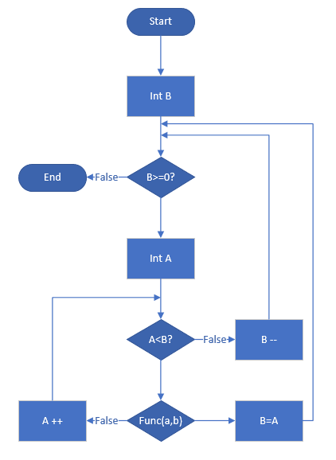
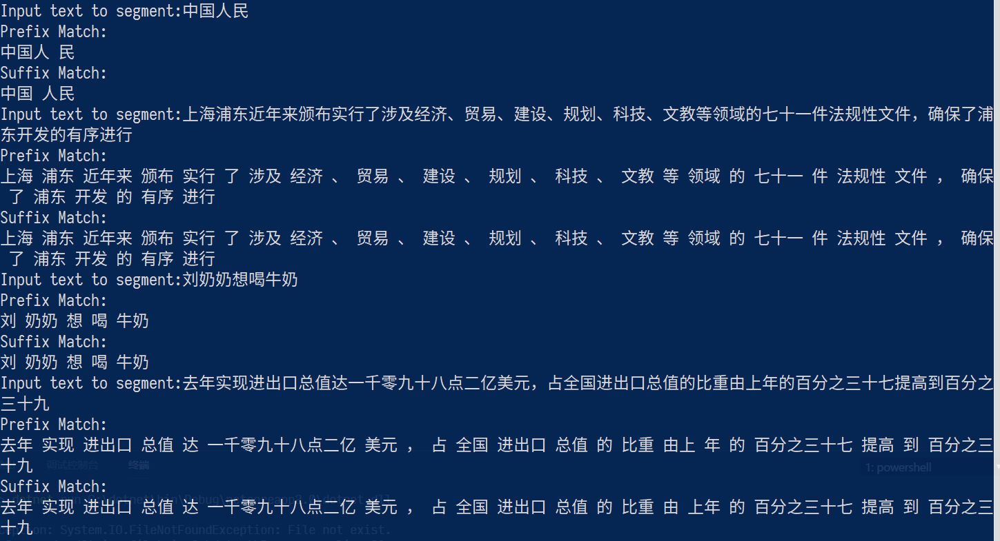

# 基于字典的前缀最大匹配和后缀最大匹配分词算法

## V1

### 实现功能

统计当前目录(current directory)下`segmented`文件夹中的所有文件中所有词语出现的数量。
这些文件由老师提供，内容是一些已经由空格将句子分为词语的文章。

### 程序逻辑

程序以行为单位读取`segmented`文件夹中的所有文件，忽略`<`开头的所有行。

每一行以空格作为分隔符调用`Split`方法，去掉为空的条目，获得词语数组。
每个词语使用`ToRemove`方法检查是否属于预定义的标点，如果是则不添加入字典。
如果不是标点且字典中没有该词语，则添加<*该词语*，1>键值对；如果有，则根据键取出对应的值并加等1。

最后程序遍历字典，以`词语: 数量`的格式将所有的词语和出现的次数保存在字符串中，再一次性写入当前目录下的`dic.txt`中。

### 运行结果

见[dic.txt](./dic.txt)

## V2

### 实现功能

在V1的基础上，对读到的词语进行了词性的划分，并按字统计结果。
其中单个字符使用`_S`后缀；两个及以上的词语，第一个字使用`_B`，最后一个使用`_E`，中间的使用`_M`。

### 程序逻辑

与V1基本一致。但对字进行是否是标点的判断的时候使用了系统提供的`char.IsLetterOrDigit`方法，避免了手动输入。

### 运行结果

见[result.txt](./result.txt)

## V3

### 实现功能

对当前目录下`segmented`文件夹中的每个seg后缀的文件里的词语进行多线程处理。词语的处理策略在V2的基础上加了标点的标签。

此程序可能需要`.Net Core 2.0`或`.Net FrameWork 4.7`以上才能运行，因为使用了`AppendJoin`方法。

### 程序逻辑

将程序改成了面向对象模型。
从小到大的逻辑为：

1. 对每个词语建立一个对象(Word)，重写`ToString`方法。
2. 对每个文件建立一个对象(Core)，对每一行按空格划分后使用词语类的`ToString`方法。此操作为异步操作。
3. 创建接受一个路径为参数的对象(Parser)，对路径下所有文件使用文件类。

Main函数只需提供路径，实例化Parser类，然后使用`Run`方法即可。

### 运行结果

仅取其中一个文件为例子，见[chtb_0001.nw.seg](./chtb_0001.nw.seg)。

## Trie Tree

### 实现功能

允许多线程插入的无锁普通Trie树，提供前缀匹配和完全匹配两种方法。

### 程序逻辑

每个结点包含当前字符和一个系统提供的线程安全的字典。如果当前字符为\0则判断为结束。

核心方法为`CachedMatch`方法且不公共。它通过将输入的字符串从头依次与结点进行比较，如果存在则进行下一个字符的比较；否则传出匹配失败的字符串和结点。
`Insert`方法即往剩下的结点中插入剩下的字符串；`PrefixMatch`方法返回未匹配的位置；`FullMatch`方法指示是否可以与树中词语完全匹配。它们都调用`CachedMatch`方法。

`InsertMulti`方法为多线程操作，统计数量为原子操作；更改树的深度也为原子操作。

## V4

### 实现功能

基于Trie树和V1中建立的字典实现前缀最大匹配分词和后缀最大匹配分词。建树为异步过程，不会阻塞用户输入；一次建好可以重复使用。

### 程序逻辑

* 实例化时异步读取字典并建树
* 前缀最大匹配直接对未匹配的部分循环调用Trie树的`PrefixMatch`方法，输出匹配的字符串
* 后缀最大匹配使用`FullMatch`方法，手动推进，输出匹配的字符串
* 当未匹配位置到当前位置时仍然无法匹配，当前位置向下移动并输出一个字符
* 具体算法实现参见[V4.cs](./V4.cs)；后向最大匹配算法的逻辑为：

### 运行结果

